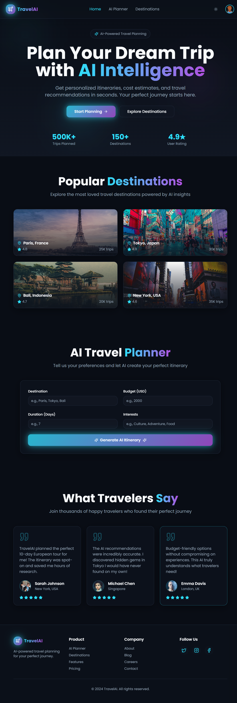

# 🌍 AI Travel Planner 

A modern **AI-powered travel planning web application (Frontend Only)** built with **Next.js and TypeScript**.  
This project provides a clean, responsive, and animated UI for an AI Travel Assistant that helps users plan trips, generate itineraries, discover destinations, and get smart travel recommendations.
---

## ✨ Features

- 🧠 AI Travel Assistant UI (Chat-style interface)
- 🗺️ Destination discovery & suggestions
- 📅 Trip itinerary planner UI
- 🌙 Dark / Light mode
- 📱 Fully responsive (Mobile, Tablet, Desktop)
- ⚡ Built with Next.js App Router
- 🎨 Modern UI with smooth animations
- 🔍 SEO-friendly pages
- 🧩 Component-based architecture
- 🚀 Fast performance & optimized layout

---

## 🛠️ Tech Stack

- **Framework:** Next.js
- **Language:** TypeScript
- **Styling:** Tailwind CSS
- **State Management:** React Hooks
- **Icons:** Lucide / Heroicons
- **Animations:** Framer Motion
- **Routing:** Next.js App Router

---

## 📁 Project Structure

├── app/
│ ├── layout.tsx
│ ├── page.tsx
│ ├── travel/
│ │ └── page.tsx
│ ├── chat/
│ │ └── page.tsx
│
├── components/
│ ├── Navbar.tsx
│ ├── Footer.tsx
│ ├── ChatUI.tsx
│ ├── DestinationCard.tsx
│ ├── ItineraryTimeline.tsx
│
├── styles/
│ └── globals.css
│
├── public/
│ └── images/
│
├── types/
│ └── travel.ts
│
├── utils/
│ └── constants.ts
│
├── README.md
├── package.json
├── tsconfig.json
└── next.config.js

yaml
Copy code

---

## 🚀 Getting Started

### 1️⃣ Clone the Repository

```bash
git clone https://github.com/AliAtherAyyubi/AI-Travel-App.git

2️⃣ Install Dependencies
bash
Copy code
npm install
# or
yarn install
# or
pnpm install
3️⃣ Run Development Server
bash
Copy code
npm run dev
Open your browser and navigate to:

arduino
Copy code
http://localhost:3000
🔌 AI Integration (Optional)
This project is AI-ready.
You can easily connect it with:

OpenAI API

Gemini API

Custom AI backend

LangChain / AI agents

Example Integration Flow:
nginx
Copy code
Frontend → API Route → AI Model → Response → UI
🎯 Use Cases
AI Travel Planner Website

Travel Startup Landing App

SaaS Travel Tool Frontend

AI Agent UI Template

Envato / ThemeForest Product

Portfolio Project

📦 Deployment
You can deploy this project easily on:

Vercel (Recommended)

Netlify

Cloudflare Pages

Vercel Deployment:
bash
Copy code
npm run build

🖼️ Screenshots




⚠️ Disclaimer
This project includes frontend only

No AI logic or backend is provided

API integration must be implemented separately

📜 License
This project is licensed under the MIT License.
You are free to modify and use it for personal or commercial projects.

👨‍💻 Author
Ali Ather
Frontend Developer | Next.js | React | TypeScript

⭐ Support
If you like this project:

⭐ Star the repository

🐛 Report issues

🤝 Contribute improvements
